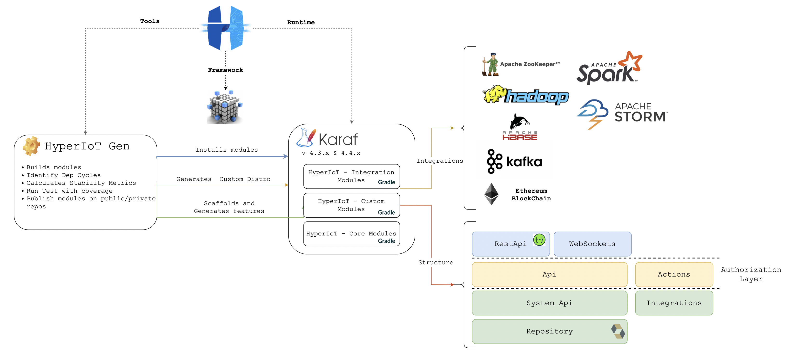
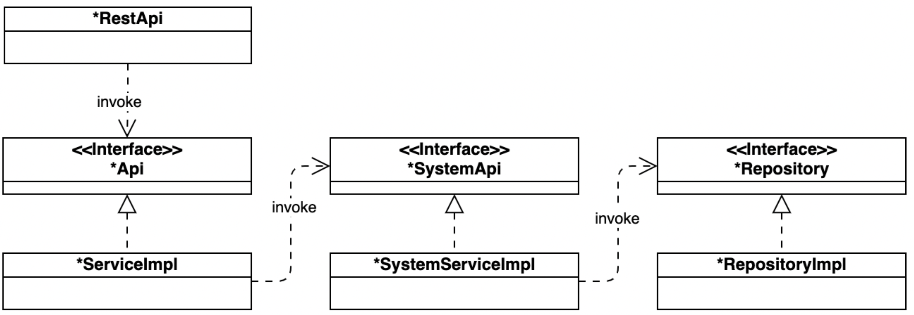
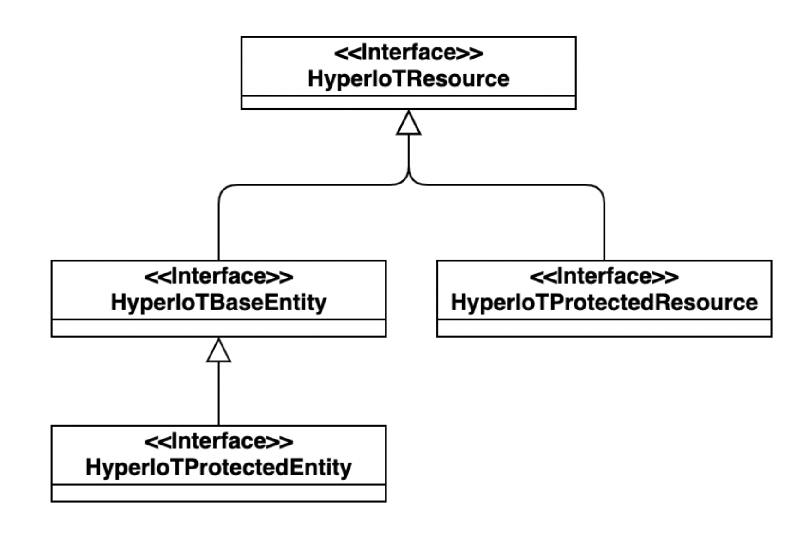
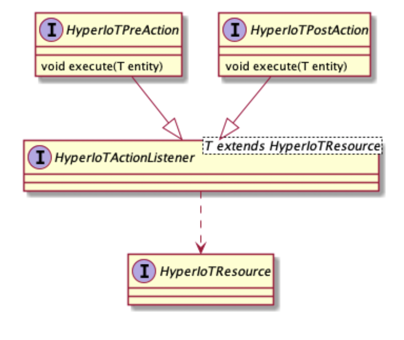
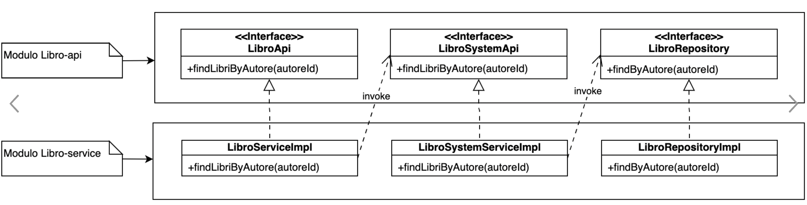
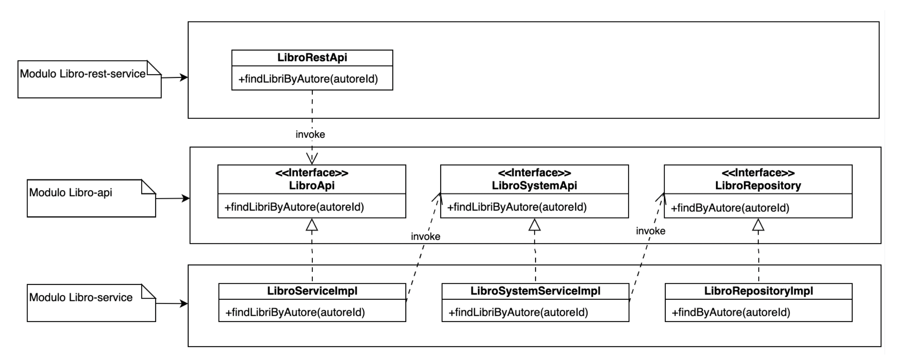
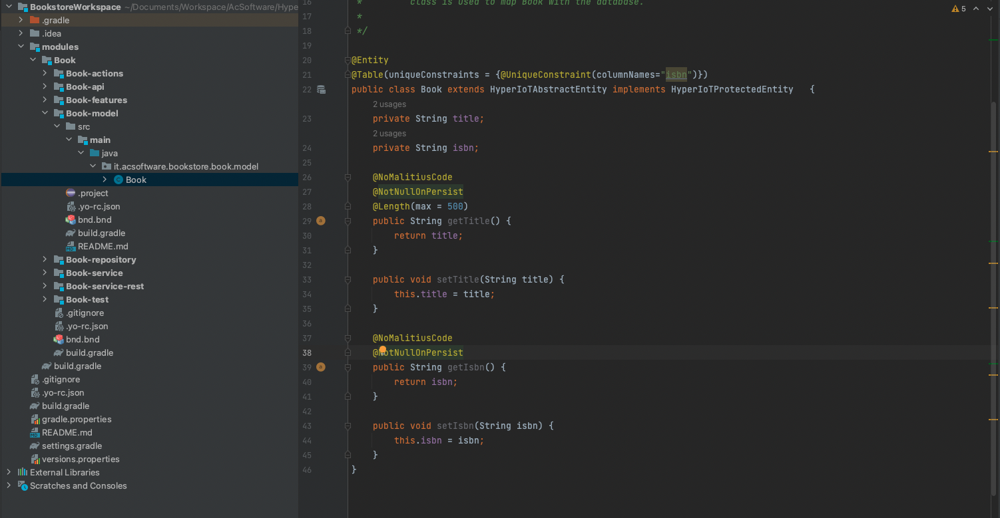

# HyperIoT Framework #

# Summary

- [What is HyperIoT Framework ?](#what-is-hyperiot-framework-?)
- [Convention Over Coding](#convention-over-coding)

## What is HyperIoT Framework ?

HyperIoT OSGi Framework was born as a solution for µSerivces fast development.

The main goal is very simple: It allows you to write Domain Driven µServices applications in a short amount of time providing a ready-to-use framework that simplifies development with a series of out-of-box features, offering integrations and patterns for microservices-oriented development.

The framework is based on a paradigm coined by us "Convention over coding": the structure of the applications follows certain mechanisms and dynamics that enables you to have a truly simple management of the code (from development to build and distribution) and the remote control of interfaces . 
The "Convention over coding" is not just a "development according to a standard" but it's a set of techniques, tools and conventions on the code which, if respected, drastically reduce development times and code manainance.

Imagine having to write a micro-service that performs the CRUD of an entity: the developer will have a generator that will create the basic infrastructure for the micro-service in terms of: persistence layer with related transactions, entity validation layer, class layer for business logic and finally the rest services. 
What the developer has to do it's just to define the entity in terms of fields and related annotation for validation and finally define the access permissions. 
Done that it can be deployed directly into the container environment.

You want to learn more? please visit [HyperIoT Framework Site](https://hyperiot-framework.acsoftware.it)!


## Convention Over Coding

The so-called "Convention over configuration" reduces the configurations to be specified by the developer who can rely on some "default" conventions of the technology used.
An example: @Entity on a Java class will associate a table with the class name if not specified. 
This approach is certainly useful and is currently used within our framework, but we have decided to go even further.

# Architecture

The while architecture can be summarized as follows:



Three main Pillars

* Framework
* Tools (The Generator)
* Runtime

## Framework

The framework abstracts many concepts avoiding boilerplate code but gives the developer the possibility to customize every aspect of his application.

Everything is based on a "core" project, HyperIoTBase. 
In particular, in the HyperIoTBase-api are defined  all the abstract concepts underlying the operations of the entire model .

## Tools - HyperIoT Generator

How easy is to use a new framework ? you have to learn all the concepts and then put them in your code in the right position exploiting framework best practise.
This is something that can lead to waste a lot of time. You "waste" time to learn framework concepts and you waste time trying to make your code work while learning the framework.
Even when you know everything about the framework you waste time to write down boilerplate code to scaffold the architecture you need.
Even when there's a new functionality , a new integration you waste time in order to undestand how to integrate it in your current solution.

The answer is to learn while you are doing and follow a "guide" who will help you to generate, evolve and adapt you code to you needs.
That's were HyperIoT Gen comes from. It can helps you to scaffolds new projects creating classes and organizing you workspace at best in order to exploit all the framework potential.
HyperIoT Gen is not a scaffolding tool, it's a developer companion you can use it to:

* deploy you modules
* build modules
* check dependencies cycles which, in big modular projects, are so hard to find
* Have stability metrics about the quality of the code in your workspace in terms of abstractions and implementations
* Scaffold integrations with different technologies saving a lot of time

## Runtime

The first implementation of HyperIoT Framework is based on OSGi so it can be run on every osgi container. We chose Apache Karaf.
Thinking about it, HyperIoT Framework it's not related to the technology but it's a model, a way to do things. Our goal is to evolve this model 
for other technologies such as Spring or Quarkus.

HyperIoT Runtime it's a custom distribution of Karaf runtime. When you generate your application runtime based on HyperIoT runtime you can choose which integrations you application should support.
At now HyperIoT Framework offers a lot of integration modules with relevant technologies which are used in most of enterprises context and which are the basic brics for complex architectures.

Main integrations available are:

* Hadoop : you can interact with hadoop file system via API or via rest services with authorized access
* Zookeeper: you interact with zookpeer creating nodes, caches or everything you need via API or rest services with authorized access
* Hbase: Expose or insert data via API or Rest services with authorized access
* Apache kafka: Implement event streaming patterns through apache kafka connector which helps you to receive or emit event in a wasy way 
* Ethereum: Sign or register data on Ethereum Blockchain with a ready to use API or rest API with authorized access
* Apache Spark: Launch or load spark jobs through API or rest services with authorized access 
* Storm: Create or monitor Storm topologies via API or rest services with authorized access

# Core Concepts

As already said HyperIoT was born for fast microservices development. Every microservices is modular and domain driven.
Every microservices can be entity related or service related. The main difference is the the first has some persistence logic the latter not.

The main structure of a microservices project is:

* Api project: all concepts related to the microservice goes here
* Model project: model or entities
* Repository:  Persistence logic goes here
* Actions: Class in which the developers delcares entity or resource permission
* Service: business logic divided in two components
  * System Service or System Api: core business logic without authorization check
  * Service or Api: this layer invokes the System Api layer but before that checks authorizations
* Rest / WebSocket: Exposing data through rest or websocket. In the rest case there's a swagger documentation automatically generated

Here a diagram that summarizes the overall design:



## HyperIoT Resources, Protected Resource and Entities 

The first concept to introduce is the "Resource". It can represent any abstract concept: from entities to pages.
Every concept you want to manage inside hyperiot for saving or authorizing or sharing should be a resource.

Resources are important because they can be of different types:

* Entities inside database

* Pages 

* Entities or abstract concepts

One resource is identified only by it's unique name.

A protected resource is a particular type of resource that requires authorization (permission system) in order to be accessed.
You can decide to define your resource as simple resources or protected one.

An entity is a particular resource type which is associated to a persistent state within the database. 
A Protected Entity is an entity which requires authorization in order to be accessed.



Resources are the building blocks on which you can decide the behaviour of your models inside you microservice application.

## Owned and Shared Resources

When you work on your microservices projects you may run into the case of developing an entity which must belong to the user has created it.
Onwed Resources or Owned Entities is something that solves the problems for you in a secure way.

You just need to implement the interface HyperIoTOwnedEntity and automatically the entity saved to the database will belong to the creator.
No user can read this entity but the owner.

Sometimes the owner can decide to share its owned resourced with other users.
If an entity it's owned but can be sharable it should implement HyperIoTSharedEntity class.

The framework provides api and services to manage and share entities and you have just to invoke these APIs from you front-end in order to use it.

## Actions and Permissions

Actions define which operations a service exposes on a resource.
In order to perform any action the logged user must have the right permissions.

Every time a protected resource or entity is defined the developer should implement a class declaring the actions available on that resource.
Most of the time the generator will do the work for you, but for custom actions sometimes you need to add some entries to actions enumeration.

## Method interceptors

HyperIoT register listeners within the application context by intercepting all components that extend the HyperIoTService interface.
A proxy component is always registered for this type of service. The purpose of this proxy is to allow pre / post invocation logics through annotations.

A simple example of annotation interceptor is the following:
```
  @Target({ ElementType.METHOD })
  @Retention(value = RetentionPolicy.RUNTIME)
  @HyperIoTInterceptorExecutor(interceptor = AllowRolesInterceptor.class)
  public @interface AllowRoles  {
  /**
  *
  * @return Role names array
    */
    String[] rolesNames() default {};
    }
```

Once the annotation has been defined, let's move on the implementation here we have two possible alternatives:

* Define an interceptor executor that implements the HyperIoTBeforeMethodInterceptor interface
* Define an interceptor executor that implements the HyperIoTAfterMethodInterceptor interface

Whichever you choose, your implementation will run either before or after the method.

```
    @Component(service = {HyperIoTBeforeMethodInterceptor.class, AllowRolesInterceptor.class}, immediate = true)
    public class AllowRolesInterceptor extends AbstractPermissionInterceptor implements HyperIoTBeforeMethodInterceptor<AllowRoles> {
      ...
      @Override
      public void interceptMethod(HyperIoTService s, Method m, Object[] args, AllowRoles annotation) {
          ...
      }
  }
```

## Pre and Post Actions

HyperIoT Framework allows you to register for standard system events such as pre-login or post-login or alternatively preSave or postSave in the case of entities to be persisted on a database.
The framework makes a clear division, however, between the concept of generic Pre / Post Action and those relating to operations on the database.



## Authentication

Currently within HyperIoT there are two authentication methods provided:

* Basic
* JWT

The framework gives the possibility of defining the concept of "Authenticable" within the services. 
In fact, nowadays it is not certain that authentication is always carried out by a (human) user, it could also be carried out by a device or application.

With these concept you can define which kind of entity can perform login on you microservices application.

## Authorization

HyperIoT Framework, defines permissions by linking one or more entity actions to a user role.
In addition to the actions that represent the so-called CRUD operations, automatically defined by the framework, it is possible to define new actions for an entity in a very simple way. 

After defining actions, it is possible, through the REST GET hyperiot/permissions/actions service, to view all the registered actions divided by entity.

To define a permission, you need to create an instance of the Permission entity (defined within the HyperIoTPermission project) by invoking the REST POST hyperiot/permissions service. 
The REST service receives the JSON as a parameter of the request body in the format:

```
{
  "name":string
  "role":{
    "id”:long
  },
  "actionIds":int,
  "entityResourceName":string
}
```

* The name key allows you to specify the name of the permission;
* entityResourceName allows you to define the entity where actions are related to;
* role.id allows you to assign permission to the user via the role id; 
* actionIds instead allows you to specify which actions are defined for the permission.

For actionIds you can assign the sum of the values returned by the actionId attributes of each action.
Let's now see, through an example, how to put into practice what is reported.

Suppose we have two roles, GUEST_USER and BACKOFFICE_USER, to be assigned to users of a library. 
We now want to define permissions on the Book entity for these two roles. 
In particular GUEST_USER must have only the permission for the find and find all actions, while BACKOFFICE_USER can perform all CRUD actions, so save, update, remove, find and find all.

The REST GET hyperiot/permissions/actions service returns the actions for the Book entity:

```
"it.acsoftware.libreria.libro.model.Libro": [
  {
    "resourceName": "it.acsoftware.libreria.libro.model.Libro",
    "actionName": "save",
    "category": "it.acsoftware.libreria.libro.model.Libro",
    "actionId": 1,
    "registered": true
  },
  {
    "resourceName": "it.acsoftware.libreria.libro.model.Libro",
    "actionName": "update",
    "category": "it.acsoftware.libreria.libro.model.Libro",
    "actionId": 2,
    "registered": true
  },
  {
    "resourceName": "it.acsoftware.libreria.libro.model.Libro",
    "actionName": "remove",
    "category": "it.acsoftware.libreria.libro.model.Libro",
    "actionId": 4,
    "registered": true
  },
  {
    "resourceName": "it.acsoftware.libreria.libro.model.Libro",
    "actionName": "find",
    "category": "it.acsoftware.libreria.libro.model.Libro",
    "actionId": 8,
    "registered": true
  },
  {
    "resourceName": "it.acsoftware.libreria.libro.model.Libro",
    "actionName": "find-all",
    "category": "it.acsoftware.libreria.libro.model.Libro",
    "actionId": 16,
    "registered": true
  }
]
```
At this point we can create the permission that should be associated with the GUEST_USER role by invoking the REST POST hyperiot/permissions service passing the JSON as the body of the request:

```
{
  "name":"GUEST_PERMISSION"
  "role":{
  "id":1
  },
  "actionIds":24,
  "entityResourceName":"it.acsoftware.libreria.libro.model.Libro"
}
```
Since users with the GUEST_USER role must be able to support the find and find all actions, actionIds contains the sum of the actionId value of the find (8) action and the actionId value of the find all (16) action. 
For simplicity, it was considered that the GUEST_USER role id was 1.

In the same way it is possible to create the permissions for users who have the GUEST_BACKOFFICE role, using the JSON as parameter of the body of the request:

```
{
  "name":"BACKOFFICE_PERMISSION"
  "role":{
  "id":2
  },
  "actionIds":31,
  "entityResourceName":"it.acsoftware.libreria.libro.model.Libro"
}
```
In this case, since users who have the GUEST_BACKOFFICE role must be able to perform all actions, actionIds contain the sum of the actionIds of save (1), update (2), remove (4), find (8 ) and find all (16). 
For simplicity, the GUEST_BACKOFFICE role id was considered to have a value of 2.

## Customizable Permission System

TODO...

# Entity Validation & Custom Tags

As previously described, the invocation path that followed by the framework, for CRUD operations, is as follows:

RestApi -> Api → SystemApi → Repository → Persistence


As a developer, you should take care to always keep this path when developing new features.
This will guarantee not only a correct separation of the various application layers but also a correct management of the entity's life cycle in terms of verification of permissions, validation and persistence.

Specifically, validation comes into play in the *SystemApi layer. 
Here, before invoking the save or update method, SystemApi executes the validator on the entity.

In addition to the tags available from javax.validation , HyperIoT offers further useful tags:

- @NoMalitiusCode: This annotation is essential for security issues. In fact, it strips malitius code from string fields. We recommend that you annotate any string fields with this annotation so that you can avoid front-end (Javascript injection) and backend (SQL-Injection) code injection attacks.
- @NotNullOnPersist: This annotation differs from @NotNull in the simple fact that it is persistent only, while @NotNull is generic. For example the swagger documentation uses @NotNull to identify the required fields.

In case of validation failure, *SystemApi will raise a HyperIoTValidationException .
This Exception class contains the information relating to which field did not pass the check with the specific error message.

Finally, the exception is also automatically converted by Jackson for the REST response

# Entity Persistence

Persistence in HyperIoT Framework is managed through JPA and Hibernate. 
Always following the convention over coding principle, the framework exploits 100% of the potential of these technologies by minimizing the code that must be written by the developers.

The entire mechanism described below is based on the use of annotations.

## Duplicates management

We know that in hibernate the definition of a unique keys occurs through the @UniqueConstraint annotation.
Within this annotation, placed on the class, it is possible to specify the fields that make up the unique key:

```
@Entity
@Table(uniqueConstraints = { @UniqueConstraint(columnNames = "username"),
@UniqueConstraint(columnNames = "email") })
...
public class HUser extends HyperIoTAbstractEntity implements HyperIoTProtectedEntity, HyperIoTUser {
  ...
}
```

the Framework uses this annotation to create uniqueness check at runtime (by running dynamic queries) in order to check the existence of duplicates before the entity itself is saved to the database.
This allows automatic error management which, in the case of duplicates, it will report the detail of the field that generated the "Duplicate entity" error.
Furthermore, this type of error is automatically converted into a JSON response (for any REST services) reporting the details mentioned above.

Once again, by fully exploiting all the technologies involved and inserting a simple annotation.

## Pre and Post CRUD Actions

As mentioned above, HyperIoT Framework allows you to define custom logics linked to the persistence cycle of any entity. 
With Pre / Posts Crud Actions it is possible to register a component that can perform its own logic before or after (depending on the need) that an entity is saved, modified or deleted.

This mechanism, as an initial choice, is inserted within the transaction of the entity itself. 
For this reason, it will be up to the developer to choose, whenever an exception occurs, whether to propagate it to make the entire transaction fail or to manage it locally so that the transaction of the main entity ends correctly.

Here an example of PostSave Action:

```
@Component(service = HyperIoTPostSaveAction.class, property = {"type=<entity_package_with_className>"})
public class MyPostAction <T extends HyperIoTBaseEntity> implements HyperIoTPostSaveAction<T> {

    @Override
    public void execute(T entity) {
      ....
    }

}

```

# Rest API

The HyperIoT Framework REST services layer is based on Apache CFX.

HyperIoT Framework decouples the services layer from the REST services layer ; this makes the REST services layer not mandatory allowing you to create projects without the * rest-service module. 
At any time it will be possible to insert this module using the yo hyperiot:new-rest-module generator command.

Inside the *rest-service module there is the *RestApi class which contains the methods that define and allow you to expose the endpoints for invocation through REST calls of the services.
The class generated through the generator extends the HyperIoTBaseEntityRestApi class, thus automatically exposing the REST services for CRUD operations.
The * RestApi classes are annotated with the @Component annotation thus making them OSGi components, and through the property service.exported.intents = swagger also the swagger documentation of the REST services is automatically generated, reachable at the URL http: ip: port /hyperiot/*/api-docs?url=/hyperiot/*/swagger.json. In addition, a REST service is also generated which returns the swagger documentation in json or yaml format.

Let's see now, through a simple example, how to add a new REST service different from those generated automatically.
Let's consider such a project:



We want to expose, at this point, the findLibriByAuthor service as a REST service. Now we need to generate, wheter it is not already present, the Book-service-rest project.
Obviously, in LibroRestApi there are methods for exposing as REST services the CRUD operations on the Book entity.

To expose the REST service findLibriByAuthor just add in LibroRestApi the method:

```
  @GET
  @Path("/byAutoreId/{autoreId}")
  @Produces(MediaType.APPLICATION_JSON)
  @LoggedIn
  @ApiOperation(value = "/hyperiot/libros/byAutore/{autoreId}", notes = "Service for finding books by author id", httpMethod = "GET", produces = "application/json",authorizations = @Authorization("jwt-auth"))
  @ApiResponses(value = { @ApiResponse(code = 200, message = "Successful operation"),
  @ApiResponse(code = 403, message = "Not authorized"),
  @ApiResponse(code = 500, message = "Internal error") })
  @JsonView(HyperIoTJSONView.Public.class)
  public Response findLibriByAutore(@ApiParam(value = "The author id", required = true) @PathParam("autoreId") long autoreId) {
    log.log(Level.FINE, "In Rest Service GET /libreria/libros/byAutore/{0}", autoreId);
    try {
      return Response.ok(this.entityService.findLibriByAutore(autoreId)).build();
    } catch (Throwable t) {
      return this.handleException(t);
    }
  }
```
By using the entityService which is a LibroServiceApi interface we realize the following pipe:



## More Details

Here you can find framework main concepts, for a deeper details please visit: [HyperIoT Framework Site](https://hyperiot-framework.acsoftware.it)!

# Getting Started

You can find below all the necessary steps to let you download and run a project with HyperIoT Framework.

## Pre-Requisites

* Install Node and NPM on your machine
* Install yeoman generator with 
  * ``` npm install -g yeoman ```
* Install HyperIoT generator with
  * ``` npm install -g generator-hyperiot -registry https://nexus.acsoftware.it/nexus/repository/npm-acs-public-repo ```
* Install Gradle up to 6.9 version
* Install JDK 11 or later

## Create a workspace

Let's call our example a Bookstore example. First of all let's create the workspace in which we will put our modules:

From the container folder let's type:

``` yo hyperiot:new-workspace ```

Now you have to answers few questions:

* Project Global Name: Bookstore
* HyperIoT Framework Version: 2.2.0
* Global Prefix: N
* Default module version: 1.0.0
* Custom repository : N

Let's go inside the workspace:

``` cd BookstoreWorkspace ```

Now, everything yo do with the generator you must do it inside this folder. 
Even if you have to perform particular operation on a single module there's no need to move to the single module folder you can operate always from the workspace.

## create a project

Let's create our first project: Book which will contain all service related to Book entity.

``` yo hyperiot:new-project ```

Now you have to answers few questions:

* Project Name: Book
* Group Id: .....
* version: 1.0.0
* Application Type: Entity
* Actions should be registered ? yes
* Has rest services ? yes
* Deploy module to maven repo ? No

if you check the modules folder inside the workspace you will find the Book folder.

## customize your model

Let's open the workspace with you IDE.
Please choose gradle version 6.9, and import the gradle workspace (IntelliJ do it automatically after changing the gradle version to 6.9)

Let's go to the Book-model inside modules/Book/Book-model and open Book entity. Let's modify in order to add some simple fields:



let's build everything with:

``` yo hyperiot:build-all ```

We are done!

## create a runtime

Let's create our custom Bookstore runtime based on HyperIoT Framework!
From the workspace let's run:

``` yo hyperiot:new-runtime ```

Now you have to answers few questions:

* Container name: bookstore
* group id: ...
* version: 1.0.0
* default web context root: bookstore
* database url: localhost
* database port: 5432
* database name: bookstore
* database username: bookstore
* database password: bookstore
* Install Cluster module (Zookeeper) ? No
* Install Kafka module ? No
* Select book module in order to be installed automatically

Now you should find the containers-src folder inside you workspace:

<workspace>/containers-src/bookstore

Inside the custom distribution folder you have:

* pom.xml already configured to generate custom karaf distribution with hyperiot framewrok and bookstore modules
* Dockerfile in order to create container version of you custom distribution
* docker-compose file in order to start postgres database with the right credentials chosen at the runtime generation time
* postman folder with a collection of rest method to invoke in order to interact with al the services.
* src folder to manage karaf configurations

Now we are ready to build our custom distribution and run it.
Inside the folder  <workspace>/containers-src/bookstore please run:

``` mvn clean package ```

It will create the target folder with inside the custom karaf distribution

## run it!

* Start docker engine

Inside the folder <workspace>/containers-src/bookstore

* run ``` docker-compose -f  ocker-compose-svil-basic.yml up ```
* run ./target/assebly/bin/karaf debug clean

Now open Postman and import all files inside <workspace>/containers-src/bookstore/postman both environment folder and the collection.

Run you services, before you invoke them you have to login with the authentication service!


## Example Project

You can finde the complete Bookstore example project [here](https://github.com/ACSoftwareTeam/BookstoreExample).

# Technical Details

## Deploy new framework version

This task must be used in a release to update HyperIoT/Karaf version inside the entire project.
It update also the version of test distribution.

gradle newRelease -Dhyperiot.version=X -Dkaraf.version=Y

## Install new plugin version

This task must be used in the plugin folder to install new plugin version.

gradle mavenToPublishLocal
